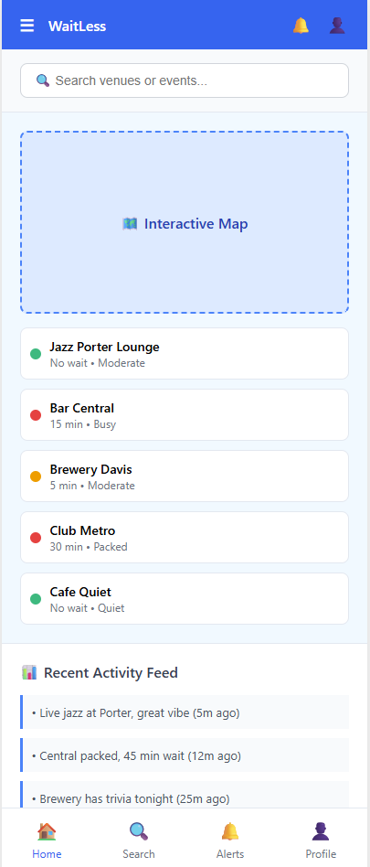
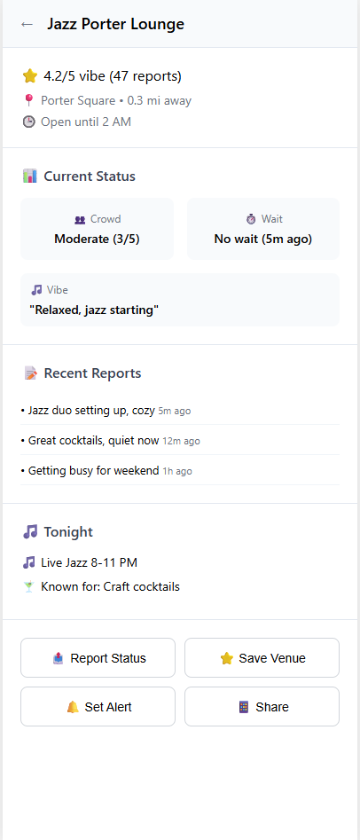
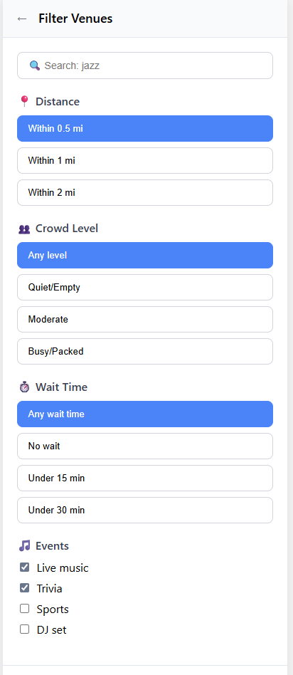

# UI Sketches: WaitLess App

## Screen 1: Home/Map View

**Key Features:**
- **Header**: App branding with notification and profile icons
- **Search Bar**: Quick venue and event discovery
- **Map View**: Interactive map with color-coded venue pins
- **Venue List**: Real-time crowd status (🟢 Green = good, 🟡 Yellow = moderate, 🔴 Red = busy)
- **Activity Feed**: Recent user reports showing current conditions and events

## Screen 2: Venue Details

**Key Features:**
- **Venue Header**: Back navigation with venue name
- **Rating & Location**: Community vibe score and distance information
- **Current Status**: Real-time crowd level and wait time with last update
- **Recent Reports**: User-contributed updates with timestamps
- **Event Information**: Tonight's events and venue specialties
- **Action Buttons**: Report status, save venue, set alerts, share with friends

## Screen 3: Search & Filter

**Key Features:**
- **Search Bar**: Find venues by name or events
- **Distance Filters**: Within 0.5 mi, 1 mi, or 2 mi
- **Crowd Level Options**: Any level, quiet/empty, moderate, busy/packed
- **Wait Time Filters**: Any wait time, no wait, under 15 min, under 30 min
- **Event Categories**: Live music, trivia, sports, DJ sets
- **Filter Actions**: Reset filters or apply with result count